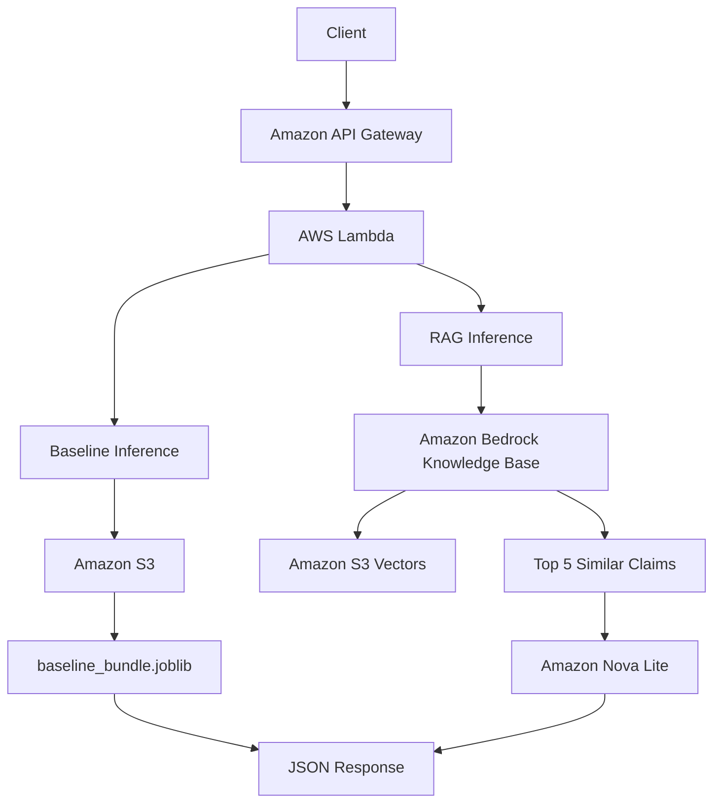

# Subocol IA — Insurance Claim Consistency Classification

## 1. Project Overview

This project implements an end-to-end machine learning system to determine whether the damage found during a vehicle inspection is consistent with the accident reported by the insured person.

The target variable is `estado_aviso`:

- `OBJETADO`: the inspected damage is not sufficiently consistent with the reported accident, contains suspicious inconsistencies, or there is not enough evidence to confidently attribute the inspected damage to the reported event.
- `ENTREGADO`: the inspected damage is sufficiently consistent with the reported accident.

Two modeling strategies are implemented and compared:

1. **Traditional Machine Learning baseline**
   - TF-IDF for the accident narrative.
   - TF-IDF for inspected parts.
   - One-hot encoding for vehicle brand.
   - Numeric claim features.
   - Logistic Regression.

2. **Retrieval-Augmented Generation (RAG)**
   - Amazon Bedrock Knowledge Bases.
   - Amazon Titan Text Embeddings V2.
   - Amazon S3 Vectors.
   - Amazon Nova Lite for final classification.

The final inference service is deployed in AWS using:

- Amazon API Gateway
- AWS Lambda
- Amazon ECR
- AWS CodeBuild
- Amazon S3
- Amazon Bedrock

The repository contains the training notebooks, reusable source code, trained baseline artifact, RAG utilities, evaluation results, and deployment files.

---

## 2. Business Objective

The goal is to determine whether the set of inspected vehicle parts can reasonably be explained by the accident narrative contained in `version_hechos`.

A false negative for `OBJETADO` is considered more costly than sending an `ENTREGADO` claim for additional review. Therefore, the project prioritizes **Recall for `OBJETADO`**, while also evaluating:

- Precision
- Recall
- F1 score
- F2 score
- Specificity
- Confusion matrix

F2 is especially important because it gives more weight to Recall than Precision.

---

## 3. Dataset

The raw dataset contains **7,532 rows** and **13 columns**.

| Column | Description |
|---|---|
| `numero_aviso` | Insurance claim identifier |
| `fecha_creacion` | Claim creation date |
| `tipo_carroceria` | Vehicle body type |
| `marca` | Vehicle brand |
| `linea` | Vehicle line/model family |
| `version` | Vehicle version |
| `modelo` | Vehicle model year |
| `version_hechos` | Accident narrative reported by the insured person |
| `codigo_irs` | IRS part code |
| `nombre_irs` | Inspected/damaged part description |
| `piezas_totales` | Total parts associated with the claim |
| `piezas_cambio` | Number of replacement parts |
| `estado_aviso` | Target label: `OBJETADO` or `ENTREGADO` |

### 3.1 Observation unit

The raw file contains multiple rows for the same `numero_aviso` because each row usually represents one inspected part.

- Raw rows: **7,532**
- Unique claims: **800**

The modeling unit is therefore **one claim**, not one raw row.

This is important because splitting the original rows directly could place parts belonging to the same claim in both training and test sets, causing data leakage.

---

## 4. Claim-Level Preprocessing

Implemented in:

```text
src/data/preprocessing.py
```

Rows are grouped by `numero_aviso`.

The following fields are reduced to one value per claim:

- `fecha_creacion`
- `tipo_carroceria`
- `marca`
- `linea`
- `version`
- `modelo`
- `piezas_totales`
- `piezas_cambio`
- `version_hechos`
- `estado_aviso`

Part descriptions are aggregated into:

```text
parts
```

and also concatenated into:

```text
parts_text
```

Additional engineered variables:

### `valid_parts`

Number of non-null `nombre_irs` descriptions for the claim.

### `vehicle_age`

Calculated as:

```text
claim creation year - vehicle model year
```

Negative values are clipped to zero.

### Final claim-level dataset

- Total claims: **800**
- `OBJETADO`: **500**
- `ENTREGADO`: **300**

Target distribution:

- `OBJETADO`: **62.5%**
- `ENTREGADO`: **37.5%**

---

## 5. Important EDA Findings

### `tipo_carroceria`

Approximately **69.4%** of raw rows have a missing `tipo_carroceria` value. Because of this high missing rate, it was excluded from the final baseline feature set.

### IRS part descriptions

`nombre_irs` has only a small amount of missing data. Claims are preserved and the number of usable descriptions is represented by `valid_parts`.

### Claim-level consistency

Fields such as `version_hechos`, `marca`, `linea`, `version`, `modelo`, and `fecha_creacion` are effectively claim-level attributes and can be reduced safely to one value per claim.

### Part counts

Claims contain very different numbers of inspected parts, making count-based features potentially informative.

---

## 6. Train / Validation / Test Split

Implemented in:

```text
src/data/split_data.py
```

The split is performed at the **claim level** and is stratified by `estado_aviso`.

Configuration:

```python
random_state=42
```

Final split:

| Split | Claims | Percentage |
|---|---:|---:|
| Train | 560 | 70% |
| Validation | 120 | 15% |
| Test | 120 | 15% |
| **Total** | **800** | **100%** |

No claim appears in more than one split.

For the RAG approach, only the **560 training claims** are inserted into the Bedrock Knowledge Base. Validation and test claims are never used as retrieval documents.

---

# 7. Approach 1 — Traditional Machine Learning Baseline

## 7.1 Model

The baseline model is **Logistic Regression** implemented with scikit-learn.

Its purpose is to provide a simple, reproducible benchmark before introducing the more complex RAG solution.

---

## 7.2 Feature Representation

Feature construction is implemented in:

```text
src/baseline/features.py
```

Four feature groups are combined.

### A. Accident narrative

Column:

```text
version_hechos
```

Representation:

```text
TF-IDF
```

using `TfidfVectorizer`.

### B. Inspected parts

Column:

```text
parts_text
```

Representation:

```text
TF-IDF
```

using a separate vectorizer.

Separate vectorizers are used because the accident narrative and part descriptions represent different text domains.

### C. Vehicle brand

Column:

```text
marca
```

Representation:

```python
OneHotEncoder(handle_unknown="ignore")
```

### D. Numeric features

Final numeric variables:

```text
vehicle_age
piezas_totales
valid_parts
```

They are transformed with:

```text
StandardScaler
```

The final sparse feature matrix contains approximately **5,324 features**.

---

## 7.3 Logistic Regression Hyperparameters

Training is implemented in:

```text
src/baseline/train.py
```

Final configuration:

```python
LogisticRegression(
    C=1.0,
    class_weight="balanced",
    solver="liblinear",
    max_iter=1000,
    random_state=42
)
```

| Hyperparameter | Value | Purpose |
|---|---:|---|
| `C` | `1.0` | Regularization parameter |
| `class_weight` | `balanced` | Compensates for class imbalance |
| `solver` | `liblinear` | Binary classification solver |
| `max_iter` | `1000` | Allows sufficient convergence iterations |
| `random_state` | `42` | Reproducibility |

---

## 7.4 Decision Threshold

The default 0.50 probability threshold is not used.

Final threshold:

```text
0.30
```

Decision rule:

```python
OBJETADO if P(OBJETADO) >= 0.30 else ENTREGADO
```

The threshold is intentionally lower because the business objective prioritizes identifying as many `OBJETADO` claims as possible.

---

## 7.5 Saved Baseline Artifact

The trained model is serialized as:

```text
models/baseline_bundle.joblib
```

The bundle contains:

```python
{
    "model": baseline_model,
    "narrative_vectorizer": narrative_vectorizer,
    "parts_vectorizer": parts_vectorizer,
    "brand_encoder": brand_encoder,
    "numeric_scaler": numeric_scaler,
    "threshold": 0.30
}
```

This allows inference without retraining the model.

The same artifact is uploaded to Amazon S3 for AWS Lambda inference.

---

# 8. Approach 2 — Retrieval-Augmented Generation

## 8.1 RAG Objective

The RAG system uses historical claims as reference examples.

For each new claim, the system:

1. Builds a text representation of the current claim.
2. Retrieves the most semantically similar historical training claims.
3. Sends the current claim and retrieved examples to Amazon Nova Lite.
4. Requests a final `OBJETADO` or `ENTREGADO` classification.

---

## 8.2 Historical Claim Documents

Document creation is implemented in:

```text
src/rag/prepare_documents.py
```

Each training claim becomes one document containing:

- Claim ID
- Creation date
- Vehicle brand
- Vehicle line
- Vehicle version
- Model year
- Vehicle age
- Accident narrative
- Inspected parts
- Total parts
- Valid part count
- Historical decision

The historical label is included as:

```text
Decisión histórica
```

Only training claims are used as historical documents.

---

## 8.3 Current-Claim Query

For validation, testing, and production inference, the current claim includes:

- Vehicle information
- Accident narrative
- Inspected parts
- Total part count
- Valid part count

The true `estado_aviso` is **never included** in the query.

This avoids label leakage.

---

## 8.4 Bedrock Knowledge Base Configuration

| Component | Final configuration |
|---|---|
| Service | Amazon Bedrock Knowledge Bases |
| Embedding model | Amazon Titan Text Embeddings V2 |
| Embedding dimension | 1024 |
| Embedding type | Float |
| Vector store | Amazon S3 Vectors |
| Source | Amazon S3 |
| Chunking | No chunking |
| Document unit | One complete claim |

No chunking is used because each document already represents one complete insurance claim and should remain semantically intact.

---

## 8.5 Retrieval

Implemented in:

```text
src/rag/retrieve.py
```

Final retrieval configuration:

```text
top_k = 5
```

Therefore, every new claim is compared against the five most semantically similar historical training claims.

---

## 8.6 Foundation Model

Final model:

```text
Amazon Nova Lite
```

Model ID:

```text
amazon.nova-lite-v1:0
```

Generation configuration:

```text
temperature = 0
maxTokens = 20
```

A temperature of zero reduces output variability and makes classification behavior more deterministic.

The model is instructed to return only:

```text
OBJETADO
```

or:

```text
ENTREGADO
```

---

## 8.7 Prompt Strategy

The selected prompt asks the model to reason about:

1. The reported accident.
2. The location and type of inspected damage.
3. Whether the inspected parts are reasonably explained by the accident.

An explicit business rule states that failing to identify an `OBJETADO` claim is more costly than reviewing an `ENTREGADO` claim.

Therefore, meaningful uncertainty should favor `OBJETADO`.

Historical claims are used as reference examples, but the final decision should be based primarily on the relationship between the reported event and inspected damage.

---

# 9. RAG Experiments

Several alternatives were tested before selecting the final configuration.

Final configuration:

```text
Natural semantic retrieval
Top K = 5
Selected business-rule prompt
Original claim representation
```

Rejected experiments included:

- An overly aggressive prompt that caused nearly every case to be classified as `OBJETADO`.
- Balanced retrieval that forced examples from both classes.
- `top_k = 10`.
- `top_k = 20`.
- Additional rule-based accident-zone enrichment.

These alternatives reduced Recall, F1, F2, or overall balance compared with the selected final configuration.

---

# 10. Evaluation Metrics

Evaluation utilities are implemented in:

```text
src/baseline/evaluate.py
```

Positive class:

```text
OBJETADO
```

Metrics:

- **Precision**: among predicted `OBJETADO` claims, how many are actually `OBJETADO`.
- **Recall**: among true `OBJETADO` claims, how many are correctly identified.
- **F1**: harmonic mean of Precision and Recall.
- **F2**: similar to F1, but gives more weight to Recall.
- **Specificity**: among true `ENTREGADO` claims, how many are correctly identified.
- **Confusion matrix**: detailed counts of correct and incorrect class decisions.

Specificity is especially important because a model could obtain very high objection Recall simply by predicting almost everything as `OBJETADO`.

---

# 11. Final Results

## 11.1 Validation Results

| Model | Precision | Recall | F1 | F2 | Specificity |
|---|---:|---:|---:|---:|---:|
| Logistic Regression | 0.664 | **0.947** | **0.780** | **0.872** | 0.200 |
| RAG | **0.714** | 0.800 | 0.755 | 0.781 | **0.467** |

### Baseline validation confusion matrix

Class order:

```text
[ENTREGADO, OBJETADO]
```

```text
[[ 9, 36],
 [ 4, 71]]
```

### RAG validation confusion matrix

```text
[[21, 24],
 [15, 60]]
```

---

## 11.2 Test Results

| Model | Precision | Recall | F1 | F2 | Specificity |
|---|---:|---:|---:|---:|---:|
| Logistic Regression | 0.623 | **0.947** | 0.751 | **0.858** | 0.044 |
| RAG | **0.741** | 0.840 | **0.788** | 0.818 | **0.511** |

### Baseline test confusion matrix

```text
[[ 2, 43],
 [ 4, 71]]
```

Interpretation:

- Correct `ENTREGADO`: 2
- `ENTREGADO` incorrectly flagged as `OBJETADO`: 43
- Missed `OBJETADO`: 4
- Correct `OBJETADO`: 71

The baseline achieves extremely high Recall but very low specificity.

### RAG test confusion matrix

```text
[[23, 22],
 [12, 63]]
```

Interpretation:

- Correct `ENTREGADO`: 23
- `ENTREGADO` incorrectly flagged as `OBJETADO`: 22
- Missed `OBJETADO`: 12
- Correct `OBJETADO`: 63

The RAG system sacrifices some Recall but provides substantially better Precision, F1, and Specificity.

---

# 12. Model Comparison

## Logistic Regression

### Strengths

- Very high `OBJETADO` Recall.
- Fast inference.
- Simple architecture.
- Reproducible.
- Low computational cost.

### Weaknesses

- Very low specificity on the test set.
- Tends to flag most claims as `OBJETADO`.
- Limited ability to reason explicitly about semantic contradictions between the narrative and inspected parts.

## RAG

### Strengths

- Better Precision.
- Better F1.
- Much better specificity.
- Uses semantically similar historical claims.
- Can reason about relationships between accident narrative and inspected parts.

### Weaknesses

- Lower `OBJETADO` Recall than the baseline.
- Higher latency.
- Requires AWS Bedrock resources.
- More complex and more expensive than Logistic Regression.

## Business interpretation

If the only objective were to maximize `OBJETADO` Recall, the baseline would be attractive.

However, the RAG solution provides a much better balance between identifying objections and avoiding unnecessary objections.

For that reason, the final API exposes both approaches individually and together.

---

# 13. Repository Structure

```text
subocol-ia/
│
├── notebooks/
│   ├── main.ipynb
│   └── exploration.ipynb
│
├── src/
│   ├── config.py
│   │
│   ├── data/
│   │   ├── s3_io.py
│   │   ├── preprocessing.py
│   │   └── split_data.py
│   │
│   ├── baseline/
│   │   ├── features.py
│   │   ├── train.py
│   │   └── evaluate.py
│   │
│   ├── rag/
│   │   ├── prepare_documents.py
│   │   ├── retrieve.py
│   │   └── classify.py
│   │
│   └── api/
│       ├── schemas.py
│       ├── inference.py
│       └── lambda_handler.py
│
├── data/
│   └── processed/
│       ├── model_comparison.csv
│       ├── rag_validation_results.csv
│       └── rag_test_results.csv
│
├── models/
│   └── baseline_bundle.joblib
│
├── Dockerfile
├── buildspec.yml
├── buildspec-backup.yml
├── requirements.txt
├── requirements-lambda.txt
├── .gitignore
└── README.md
```

---

# 14. File Responsibilities

## `notebooks/main.ipynb`

Main final project notebook.

Responsibilities:

- Load data.
- Build claim-level dataset.
- Create train/validation/test split.
- Train baseline.
- Evaluate baseline.
- Save baseline artifact.
- Prepare RAG training documents.
- Evaluate RAG.
- Generate model-comparison results.

## `notebooks/exploration.ipynb`

Used for:

- EDA.
- Data consistency checks.
- Feature investigation.
- Preliminary experiments.

## `src/data/preprocessing.py`

Transforms part-level rows into one row per claim.

## `src/data/split_data.py`

Creates the stratified train/validation/test split.

## `src/data/s3_io.py`

Reusable Amazon S3 operations.

## `src/baseline/features.py`

Builds baseline feature matrices.

## `src/baseline/train.py`

Trains Logistic Regression.

## `src/baseline/evaluate.py`

Computes classification metrics and confusion matrices.

## `src/rag/prepare_documents.py`

Creates historical Knowledge Base documents and inference queries.

## `src/rag/retrieve.py`

Retrieves similar claims from the Bedrock Knowledge Base.

## `src/rag/classify.py`

Builds the classification prompt and invokes Nova Lite.

## `src/api/schemas.py`

Defines the request schema with Pydantic.

## `src/api/inference.py`

Contains reusable baseline and RAG inference functions.

## `src/api/lambda_handler.py`

AWS Lambda entry point. Routes requests to:

```text
/predict/baseline
/predict/rag
/predict/compare
```

## `Dockerfile`

Defines the Lambda container image.

## `buildspec.yml`

Defines CodeBuild commands for ECR authentication, Docker build, image tagging, and image push.

---

# 15. Python Environment

The project uses Python 3.12.

Pinned core dependencies:

```text
numpy==1.26.4
pandas==2.3.3
scikit-learn==1.7.2
scipy==1.16.3
joblib==1.5.3
pydantic==2.13.4
boto3==1.43.56
```

Install with:

```bash
pip install -r requirements.txt
```

The Lambda image uses:

```text
requirements-lambda.txt
```

Matching the scikit-learn version is important because the saved model is loaded using `joblib`.

---

# 16. AWS Configuration

AWS configuration is centralized in:

```text
src/config.py
```

Required values are equivalent to:

```python
AWS_REGION = "us-east-1"
S3_BUCKET = "<YOUR_BUCKET>"
RAW_DATA_KEY = "raw/dataset_pt.csv"
RAW_DATA_URI = f"s3://{S3_BUCKET}/{RAW_DATA_KEY}"
BEDROCK_KB_ID = "<YOUR_KNOWLEDGE_BASE_ID>"
```

AWS access keys and secret keys must **not** be committed to the repository.

IAM roles should be used when running in SageMaker, CodeBuild, or Lambda.

---

# 17. Reproducing the Training Workflow

## Step 1 — Clone repository

```bash
git clone https://github.com/johnbr-udel/subocol-ia.git
cd subocol-ia
```

## Step 2 — Create Python environment

```bash
python -m venv .venv
source .venv/bin/activate
```

## Step 3 — Install dependencies

```bash
pip install -r requirements.txt
```

## Step 4 — Configure AWS resources

The project was developed in:

```text
us-east-1
```

The execution environment must have access to:

- Project S3 bucket.
- Amazon Bedrock Knowledge Base.
- Amazon Nova Lite.

## Step 5 — Upload raw dataset

The dataset is expected at a location equivalent to:

```text
s3://<YOUR_BUCKET>/raw/dataset_pt.csv
```

The loader expects a semicolon-separated CSV:

```python
pd.read_csv(..., sep=";")
```

## Step 6 — Update `src/config.py`

Configure:

- Region
- Bucket name
- Raw data key
- Knowledge Base ID

## Step 7 — Run notebook

```bash
jupyter lab
```

Open:

```text
notebooks/main.ipynb
```

and execute the final workflow.

---

# 18. Reproducing the RAG Knowledge Base

1. Generate documents from the **560 training claims**.
2. Upload them to an S3 prefix such as:

```text
s3://<YOUR_BUCKET>/rag/train/
```

3. Create an Amazon Bedrock Knowledge Base.
4. Select **Amazon Titan Text Embeddings V2**.
5. Configure **1024-dimensional float embeddings**.
6. Use **Amazon S3 Vectors** as the vector store.
7. Use the training-document S3 prefix as the data source.
8. Select **no chunking**.
9. Synchronize the Knowledge Base.
10. Save the Knowledge Base ID in `src/config.py`.

Only training claims should be included in the Knowledge Base.

---

# 19. Final AWS Architecture



---

# 20. Baseline Inference Flow

```text
New claim
   ↓
Pydantic validation
   ↓
prepare_claim_for_inference()
   ↓
TF-IDF + One-Hot + numeric transforms
   ↓
Logistic Regression predict_proba()
   ↓
Threshold = 0.30
   ↓
OBJETADO / ENTREGADO
```

The baseline bundle is downloaded to:

```text
/tmp/baseline_bundle.joblib
```

inside Lambda when needed.

---

# 21. RAG Inference Flow

```text
New claim
   ↓
build_claim_query()
   ↓
Bedrock Retrieve
   ↓
Top 5 similar historical claims
   ↓
Current claim + retrieved examples
   ↓
Amazon Nova Lite
   ↓
OBJETADO / ENTREGADO
```

---

# 22. API Request Schema

```json
{
  "version_hechos": "string",
  "piezas": [
    "string"
  ],
  "marca": "string",
  "linea": "string",
  "version": "string",
  "modelo": 2023,
  "fecha_creacion": "2025-06-01T10:30:00"
}
```

`estado_aviso` must **not** be sent during inference.

---

# 23. API Endpoints

```text
POST /predict/baseline
POST /predict/rag
POST /predict/compare
```

### Baseline response

```json
{
  "model": "baseline",
  "prediction": "OBJETADO",
  "probability_objetado": 0.64
}
```

### RAG response

```json
{
  "model": "rag",
  "prediction": "OBJETADO",
  "retrieved_claims": 5
}
```

### Comparison response

```json
{
  "baseline": {
    "prediction": "OBJETADO",
    "probability_objetado": 0.64
  },
  "rag": {
    "prediction": "OBJETADO",
    "retrieved_claims": 5
  }
}
```

---

# 24. Containerized Lambda Deployment

The inference service is packaged as a Lambda container image.

The `Dockerfile`:

1. Uses the AWS Lambda Python 3.12 base image.
2. Copies `requirements-lambda.txt`.
3. Installs dependencies.
4. Copies the `src/` package.
5. Configures:

```text
src.api.lambda_handler.lambda_handler
```

as the Lambda handler.

---

# 25. AWS CodeBuild and ECR

Because the development SageMaker environment did not expose a running Docker daemon, the final Lambda image was built using AWS CodeBuild.

Deployment flow:

```text
Source code
   ↓
Amazon S3 build source
   ↓
AWS CodeBuild
   ↓
Docker build
   ↓
Amazon ECR
   ↓
AWS Lambda
```

`buildspec.yml` performs:

```text
ECR login
docker build
docker tag
docker push
```

CodeBuild requires **privileged mode** to build Docker images.

---

# 26. Lambda Configuration

Final deployment uses approximately:

```text
Architecture: x86_64
Memory: 1024 MB
Timeout: 60 seconds
```

The Lambda execution role requires:

### S3

```text
s3:GetObject
```

for the saved baseline model.

### Bedrock Knowledge Base

```text
bedrock:Retrieve
```

### Nova Lite

```text
bedrock:InvokeModel
```

CloudWatch logging is provided by the standard Lambda execution role.

---

# 27. API Gateway

The service uses:

```text
Amazon API Gateway HTTP API
Payload format version: 2.0
Stage: $default
Auto-deploy: enabled
```

All routes point to the same Lambda function.

The Lambda handler chooses the inference branch using:

```python
event.get("rawPath", "")
```

---

# 28. Example Suspicious Claim

Example intentionally designed to contain contradictions:

```json
{
  "version_hechos": "El asegurado manifiesta que el vehículo recibió un golpe leve en la parte trasera izquierda mientras estaba estacionado. Indica que no hubo impacto en la parte delantera ni en el costado derecho.",
  "piezas": [
    "bomper delantero",
    "capot",
    "farola delantera derecha",
    "guardafango delantero derecho",
    "puerta delantera derecha",
    "puerta trasera derecha",
    "espejo retrovisor derecho",
    "bomper trasero izquierdo"
  ],
  "marca": "CHEVROLET",
  "linea": "SAIL",
  "version": "LT",
  "modelo": 2015,
  "fecha_creacion": "2025-05-20T11:30:00"
}
```

For this case:

```text
Baseline → OBJETADO
P(OBJETADO) ≈ 0.6413

RAG → OBJETADO
Retrieved claims = 5
```

The reported accident describes a small rear-left impact, while the inspection includes front, front-right, right-side, and rear-left components.

---

# 29. Operational Notes

## SageMaker

SageMaker Studio/JupyterLab was used for development, experimentation, training, and AWS integration.

The SageMaker space should be stopped when not in use to avoid unnecessary compute charges.

## Lambda

The first request can be slower because of:

- Container cold start.
- Model download/load.
- Bedrock retrieval.
- Nova inference.

## RAG cost

RAG inference costs more than baseline inference because it requires semantic retrieval and a foundation-model call.

## API security

The current API is suitable for a technical demonstration. A production deployment should additionally consider:

- Authentication and authorization.
- Rate limiting.
- Monitoring and alerting.
- Sensitive-data protection.
- Centralized configuration/secrets management.

---

# 30. Key Design Decisions

1. Aggregate to **one row per claim**.
2. Split data at the **claim level** to prevent leakage.
3. Use separate TF-IDF representations for narrative and inspected parts.
4. Use class-balanced Logistic Regression as the baseline.
5. Lower the baseline threshold to **0.30** to prioritize `OBJETADO` Recall.
6. Restrict the RAG Knowledge Base to **training claims only**.
7. Use one complete claim per RAG document with **no chunking**.
8. Use **Titan Text Embeddings V2** with **S3 Vectors**.
9. Retrieve **5 historical claims**.
10. Use **Amazon Nova Lite** with deterministic generation settings.
11. Expose baseline and RAG independently and through a comparison endpoint.
12. Use Lambda + API Gateway for serverless deployment.

---

# 31. Final Conclusion

The project demonstrates two significantly different approaches to insurance claim consistency classification.

The Logistic Regression baseline achieves very high `OBJETADO` Recall:

```text
0.947
```

but its low specificity means it flags many legitimate claims.

The RAG approach achieves:

```text
Precision:   0.741
Recall:      0.840
F1:          0.788
F2:          0.818
Specificity: 0.511
```

and provides a considerably more balanced decision profile.

The final AWS service keeps both approaches available so that predictions can be requested individually or compared for the same incoming claim.
